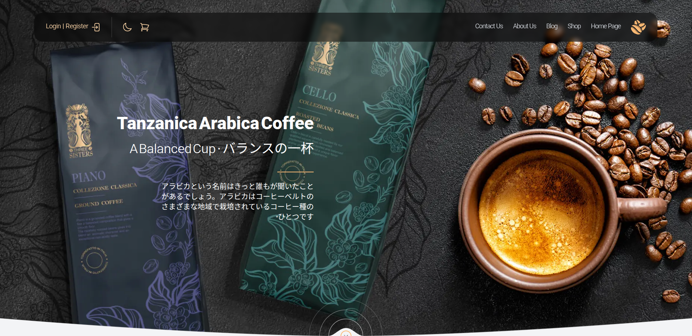

# React + Vite

## About Project
An online coffee shop website for selling all kinds of coffees

### See <a href='https://goldencoffee.liara.run'>Demo</a>

## Getting Started
First, run the development server
```bash
npm run dev
# or
yarn dev
```

Second, run the TailwindCss compiler
```bash
npm run tailwind
# or
yarn tailwind
```

Now, open <a href='http://localhost:5173/'>http://localhost:5173</a> with your browser to see the result

## Developed with


## Architecture Diagrams

### 1. System Architecture

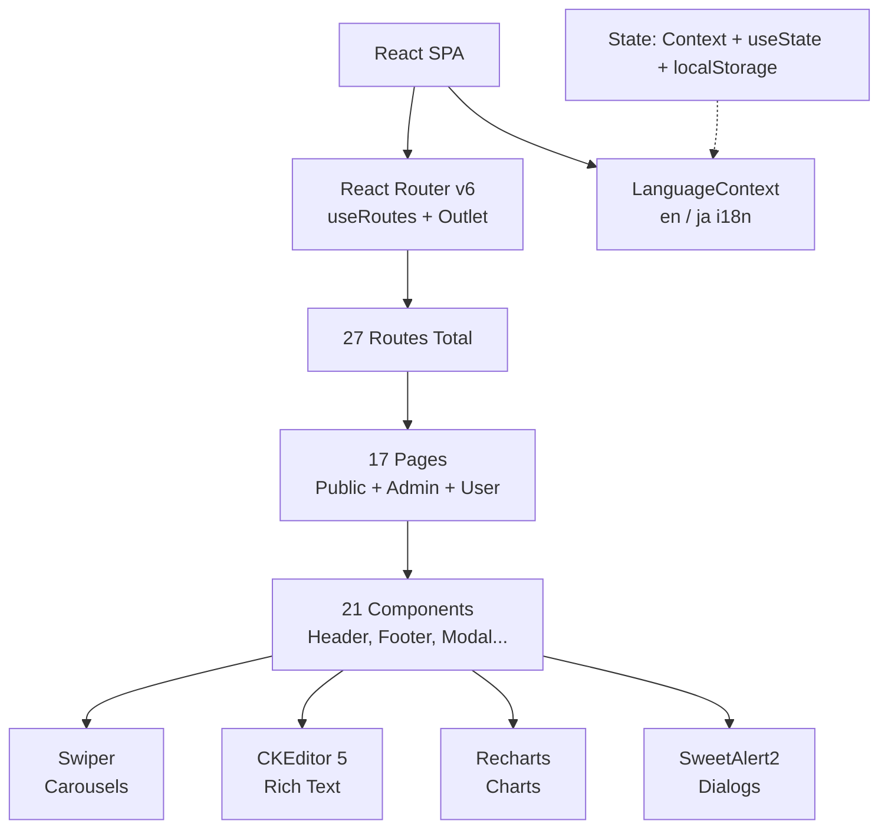

### 2. Route Tree

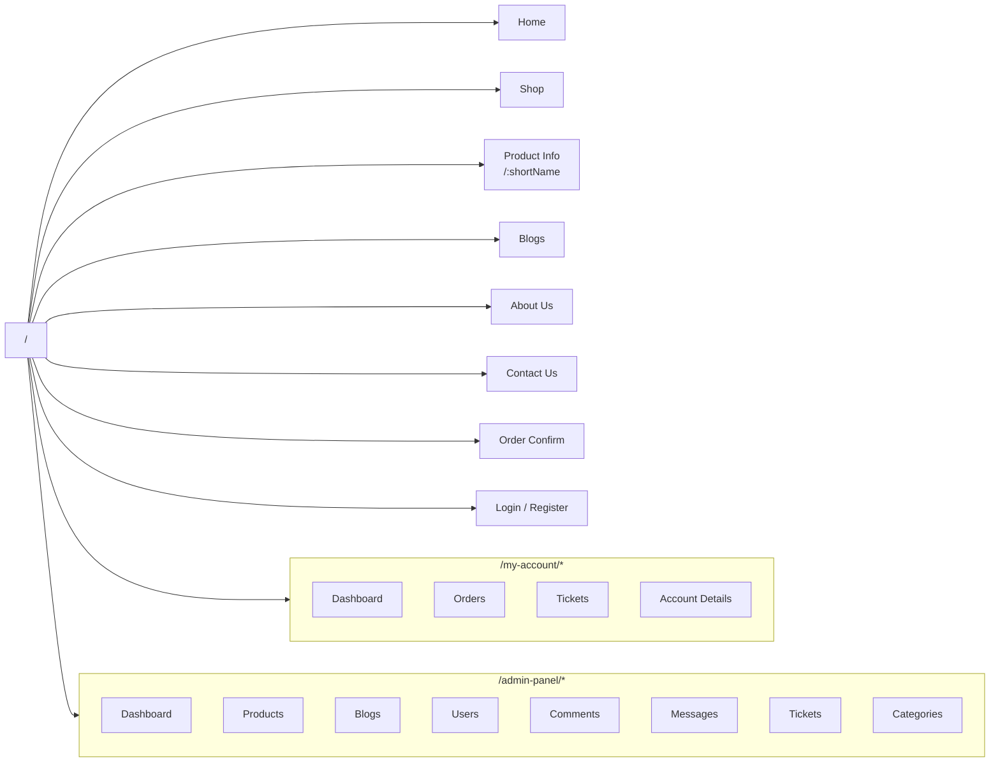

### 3. Component Hierarchy

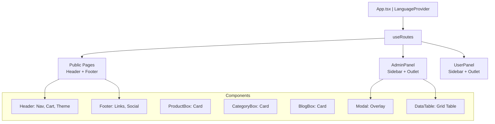

### 4. Language Context Flow

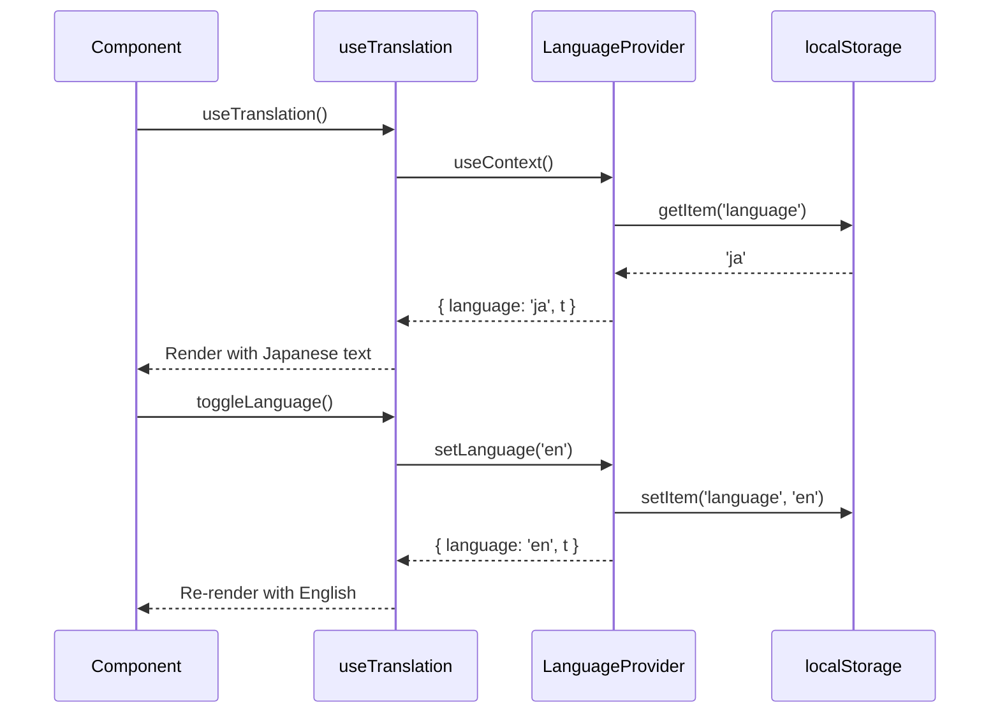

### 5. Admin CRUD State Flow

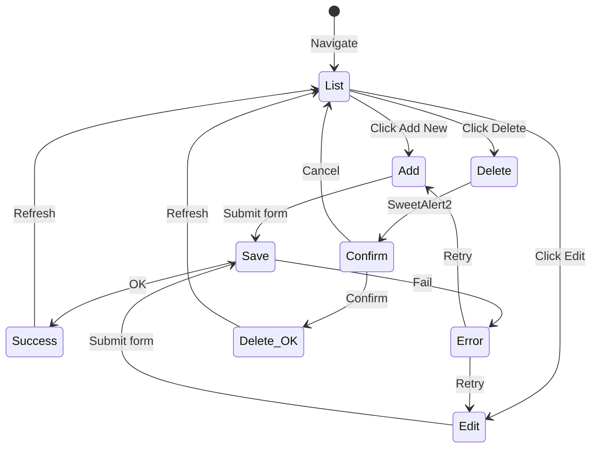

### 6. Dark Mode Initialization

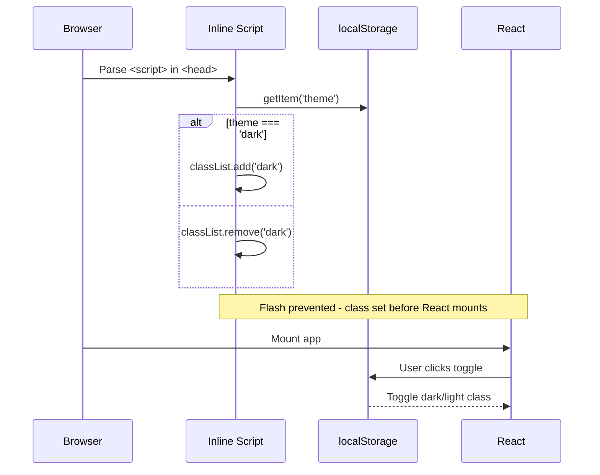

### 7. Data Model (ERD)

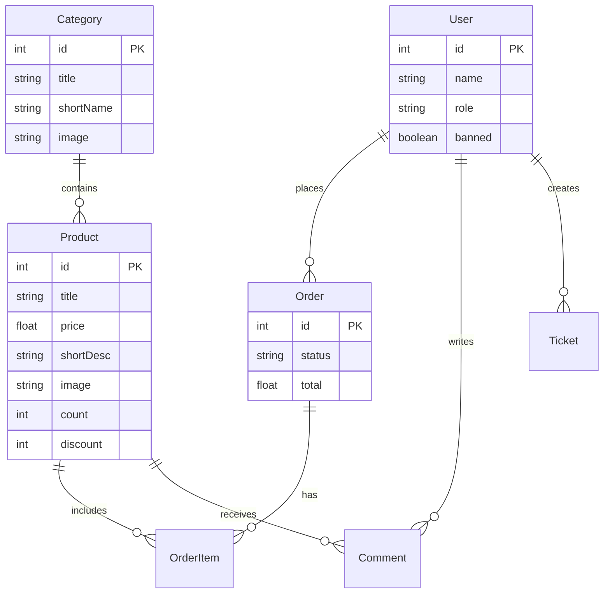

### 8. Deployment Pipeline

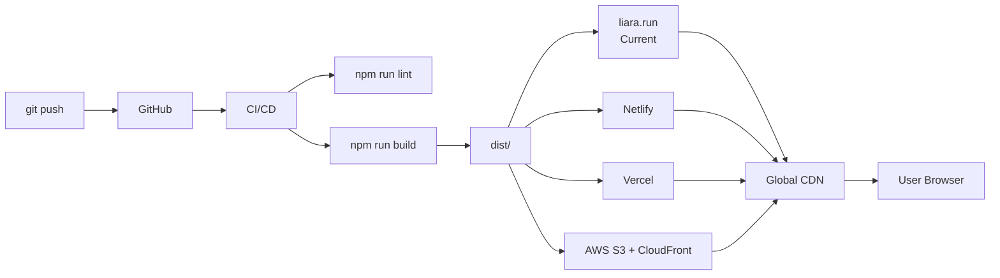

### 9. Translation Key Distribution

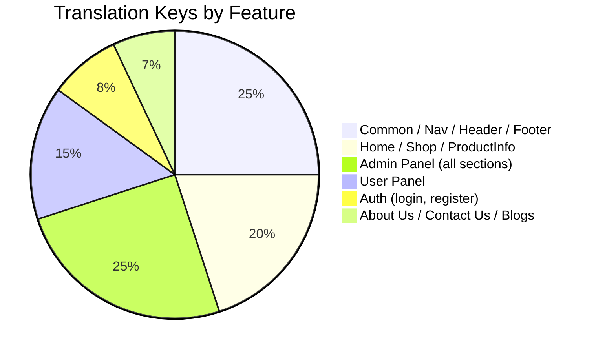

### 10. Responsive Layout Strategy

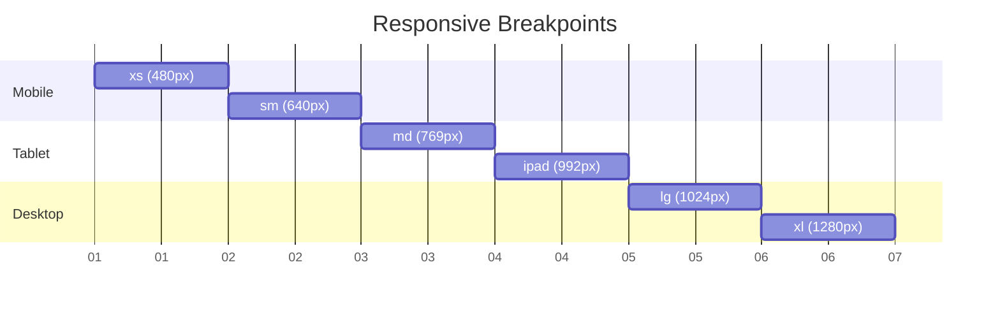

## Documentation

Full documentation is available under `/goldencoffee/homedir/docs/`:

- [Getting Started](/goldencoffee/homedir/docs/01-getting-started.md) — Setup guide
- [Architecture](/goldencoffee/homedir/docs/02-architecture.md) — Deep dive
- [Components](/goldencoffee/homedir/docs/03-components.md) — Reusable components
- [Pages](/goldencoffee/homedir/docs/04-pages.md) — Page-by-page guide
- [Admin Panel](/goldencoffee/homedir/docs/05-admin-panel.md) — CRUD operations
- [User Panel](/goldencoffee/homedir/docs/06-user-panel.md) — User features
- [Localization](/goldencoffee/homedir/docs/07-localization.md) — i18n guide
- [Dark Mode](/goldencoffee/homedir/docs/08-dark-mode.md) — Implementation
- [State Management](/goldencoffee/homedir/docs/09-state-management.md) — Patterns
- [Styling](/goldencoffee/homedir/docs/10-styling.md) — Design system
- [Performance](/goldencoffee/homedir/docs/11-performance.md) — Optimization
- [Testing](/goldencoffee/homedir/docs/12-testing.md) — Strategy
- [Deployment](/goldencoffee/homedir/docs/13-deployment.md) — Hosting
- [API Integration](/goldencoffee/homedir/docs/14-api-integration.md) — Backend
- [Contributing](/goldencoffee/homedir/docs/15-contributing.md) — Guidelines
- [Known Issues](/goldencoffee/homedir/docs/16-known-issues.md) — Limitations
- [Roadmap](/goldencoffee/homedir/docs/17-roadmap.md) — Future plans
- [Code Examples](/goldencoffee/homedir/docs/18-code-examples.md) — Snippets
- [Diagrams](/goldencoffee/homedir/docs/diagrams.md) — All diagrams

### Made with ❤ by Hadi Heidariazar
