# Golden Coffee Shop — Architecture Diagrams

## 1. System Architecture (Flowchart)

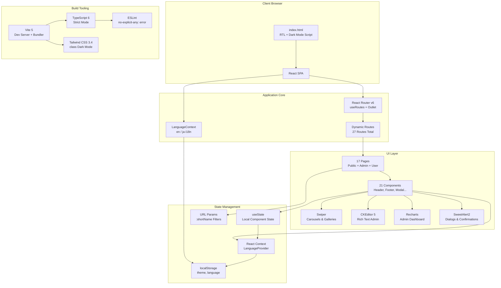

## 2. Route Tree (Flowchart LR)

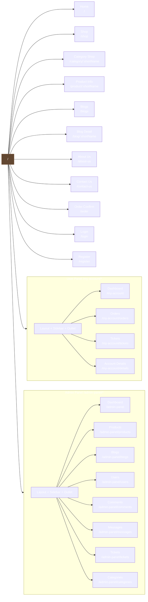

## 3. Component Hierarchy (Graph TD)

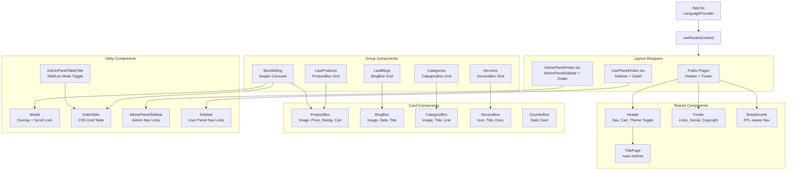

## 4. Data Flow — Language Context (Sequence Diagram)

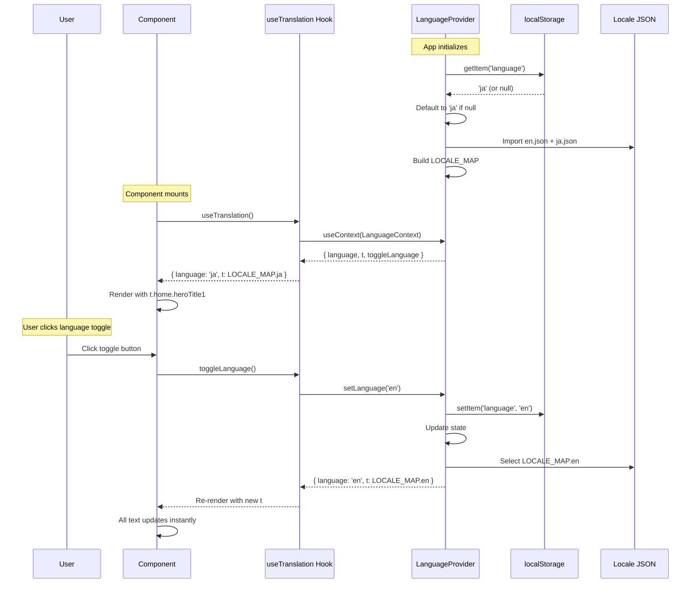

## 5. Admin CRUD Flow (State Diagram)

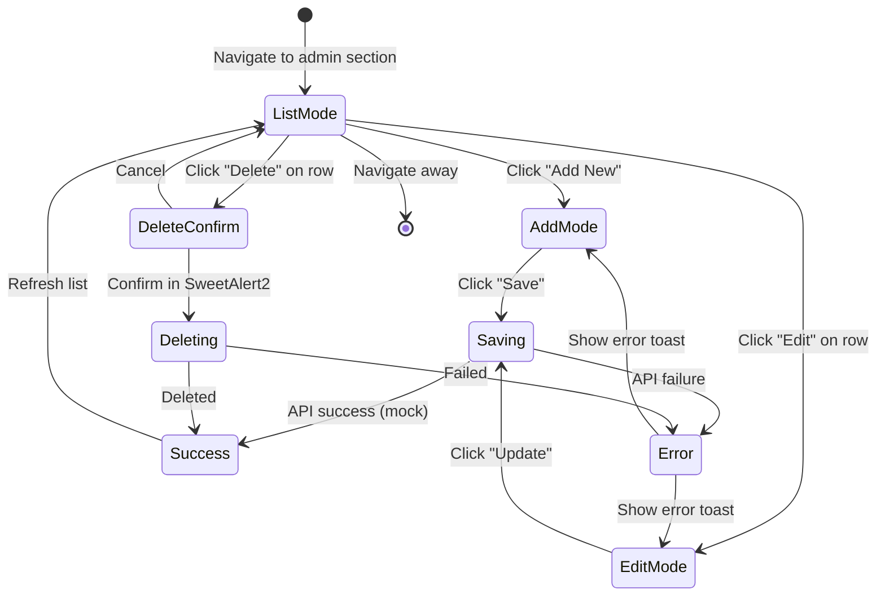

## 6. Authentication Flow (Future — Sequence Diagram)

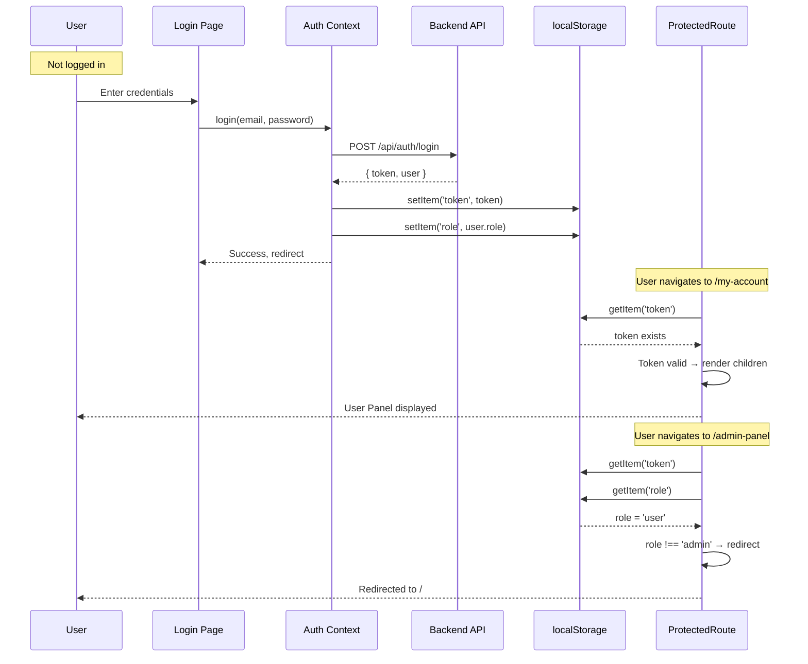

## 7. ER Diagram — Data Models

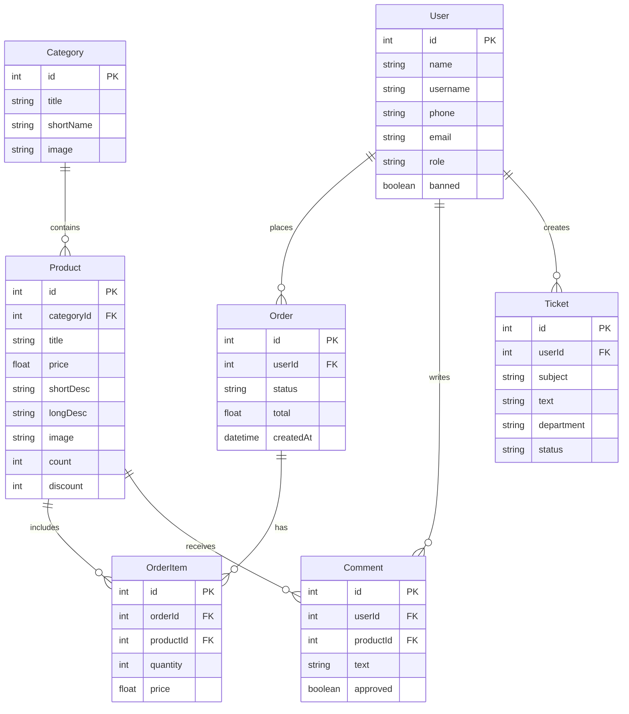

## 8. Dark Mode Initialization (Sequence Diagram)

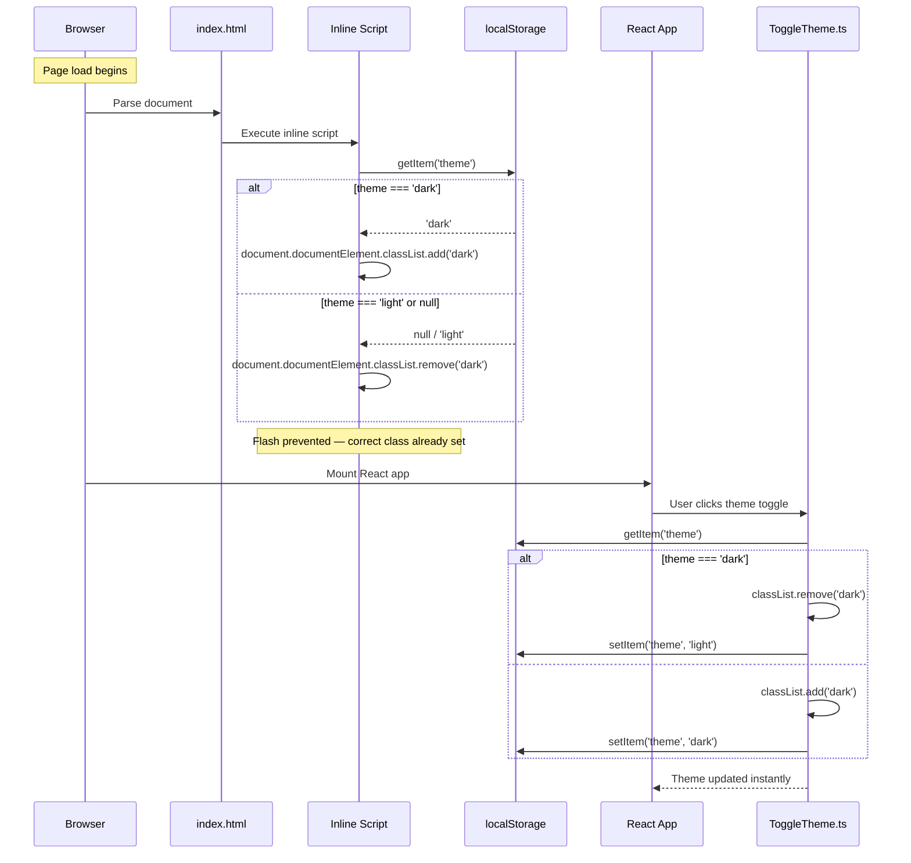

## 9. Responsive Breakpoints (Gantt)

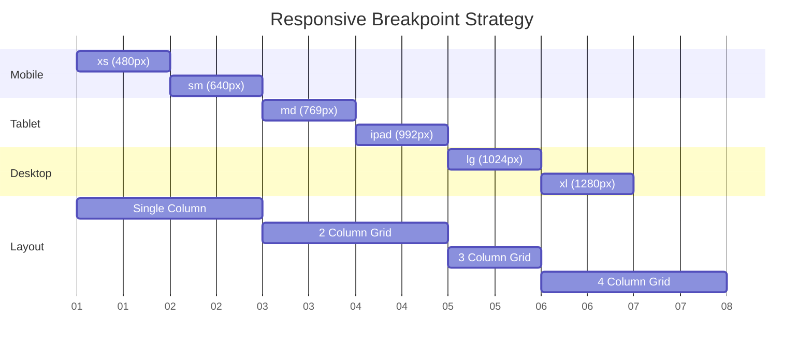

## 10. Deployment Pipeline (Flowchart LR)

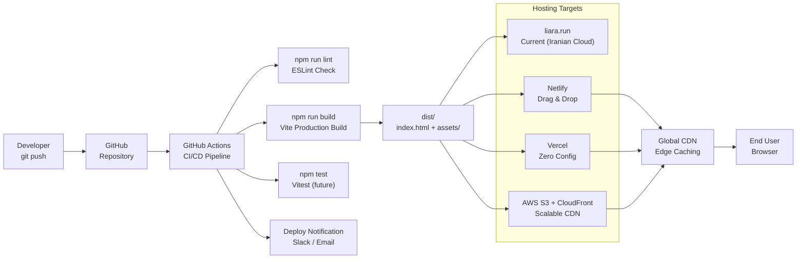

## 11. Translation Key Organization (Pie Chart)

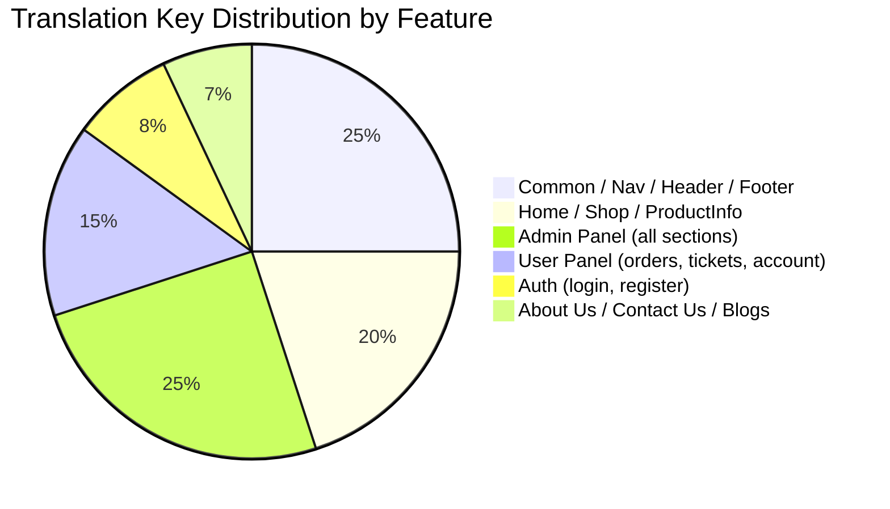

## 12. File Dependency Graph

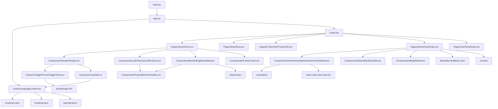
